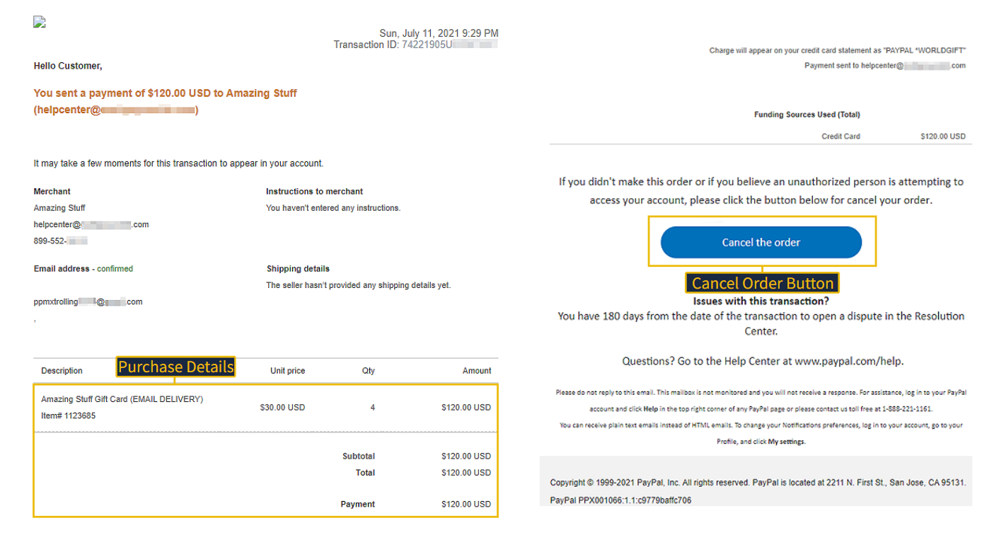
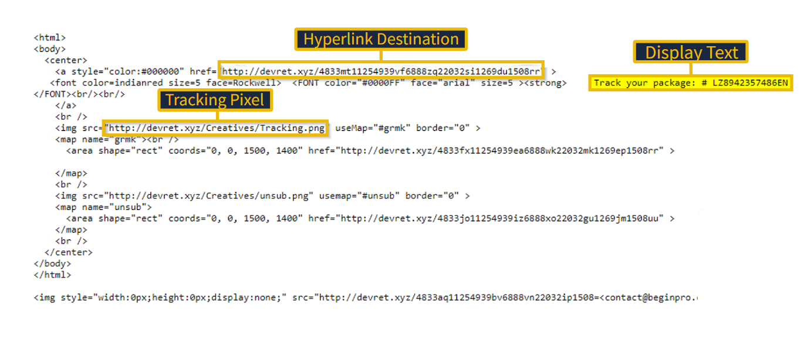
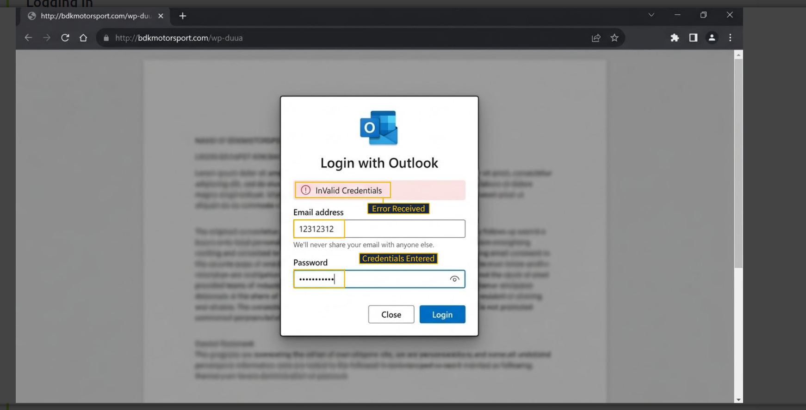

# Phishing Email Analysis

## Overview

This project documents the analysis of multiple phishing email samples in a controlled TryHackMe training environment.

The investigation focused on identifying phishing indicators, analyzing email content and sender information, investigating suspicious links and attachments, and understanding how attackers use trusted brands to deceive users.

## Objectives

* Identify phishing indicators in email headers and content.
* Analyze spoofed sender addresses and display names.
* Investigate suspicious hyperlinks and URL redirection.
* Identify tracking pixels and link manipulation techniques.
* Analyze malicious email attachments.
* Identify credential harvesting techniques.
* Document phishing techniques and recommended security controls.

## Phishing Techniques Analyzed

* Spoofed email addresses
* Brand impersonation
* Artificial urgency
* URL shortening
* Link manipulation
* URL redirection
* Tracking pixels
* Credential harvesting
* Malicious attachments

## Email Sample Analysis

### 1. Fake PayPal Transaction

The email impersonated PayPal and presented a fraudulent transaction receipt.

Key indicators included:

* Spoofed sender address
* Fake transaction details
* PayPal brand impersonation
* Suspicious recipient address
* URL shortening used to hide the final destination

### 2. Fake Shipping Notification

The email impersonated a distribution center and used a fraudulent tracking number to encourage the recipient to interact with the message.

Key indicators included:

* Spoofed sender address
* Fake tracking number
* Suspicious hyperlink
* Tracking pixel
* Link manipulation

### 3. Fake Document Notification

The email used trusted brands and multiple redirects to lead the victim toward a fraudulent login portal.

Key indicators included:

* Artificial urgency
* OneDrive impersonation
* Adobe impersonation
* Microsoft/Outlook impersonation
* Multi-stage URL redirection
* Fake login portal
* Credential harvesting

### 4. Fake Netflix Notification

The email impersonated Netflix and used a malicious PDF attachment as part of the phishing attempt.

Key indicators included:

* Brand impersonation
* Suspicious attachment
* Social engineering
* Malicious PDF document

### 5. Fake Apple Notification

The email impersonated Apple and used a malicious Microsoft Word template attachment.

Key indicators included:

* Apple brand impersonation
* BCC usage
* Suspicious `.dot` attachment
* Malicious document delivery

### 6. Fake DHL Notification

The email impersonated DHL and delivered a malicious Excel attachment.

The attachment contained a reference to an executable file:

`regasms.exe`

Key indicators included:

* DHL brand impersonation
* Malicious `.xlsx` attachment
* Executable file reference
* Social engineering

## Investigation Techniques

* Email header analysis
* Sender address verification
* Email body analysis
* HTML source inspection
* Hyperlink investigation
* URL redirection analysis
* Root domain identification
* Attachment analysis
* Phishing indicator identification

## Security Recommendations

* Verify the actual sender address instead of relying on the display name.
* Avoid clicking unexpected links or buttons.
* Inspect suspicious URLs before interacting with them.
* Be cautious of shortened and redirected URLs.
* Do not open unexpected email attachments.
* Verify unexpected requests through official channels.
* Never enter credentials into suspicious login pages.
* Report suspected phishing emails to the appropriate security team.

## Assessment Context

This project was completed in a controlled TryHackMe training environment for educational purposes.

No real-world systems or accounts were targeted.

## Skills Demonstrated

* Phishing Analysis
* Email Security
* Email Header Analysis
* URL Investigation
* Threat Identification
* Social Engineering Analysis
* Credential Harvesting Analysis
* Malicious Attachment Analysis
* Security Documentation

## Evidence

### 1. Fake PayPal Transaction

### 2. Fake Shipping Notification

### 3. Credential Harvesting

### 4. Malicious DHL Attachment

